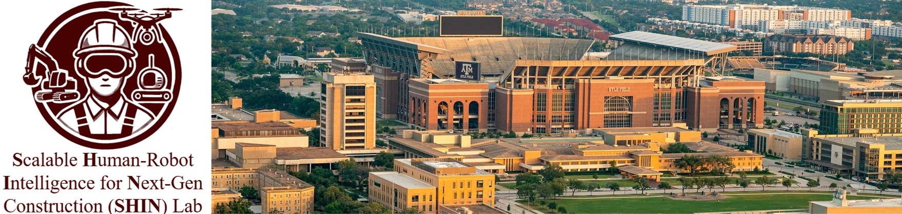

  

The **S**calable **H**uman-Robot **I**ntelligence for **N**ext-Gen Construction (**SHIN**) Lab at Texas A&M University conducts multidisciplinary research of advancing automation and intelligence technologies, and human-centered approaches to address challenges in construction and infrastructure systems. Our current research interests include:  

* Human-Robot Interaction
* Construction Automation and Robotics
* Artificial Intelligence in Construction
* Energy Infrastructure Innovation

---

## Join Us
Our research group is looking for highly self-motivated and talented students. To apply for the PhD program, please send your CV, a recent transcript and a brief description of your research experience and interests (one-page or in the email) to xin.wang@tamu.edu. Please use the "Prospective PhD Student - [Your Name]" as your email subject.

<!-- 

I am **an Assistant Professor** in the Zachry Department of Civil and Environmental Engineering at **Texas A&M University**. 

I was a postdoctoral researcher in Industrialized Construction Innovation at **National Renewable Energy Laboratory (NREL)**. I obtained my Ph.D. degree in Civil Engineering and my Master's degree in Computer Sciences from **University of Wisconsin-Madison**. Before that, I received a Master's degree and a Bachelor's degree in Civil Engineering from **Tongji University**, China. 

1. **Energy Infrastructure Innovation**

 -->
