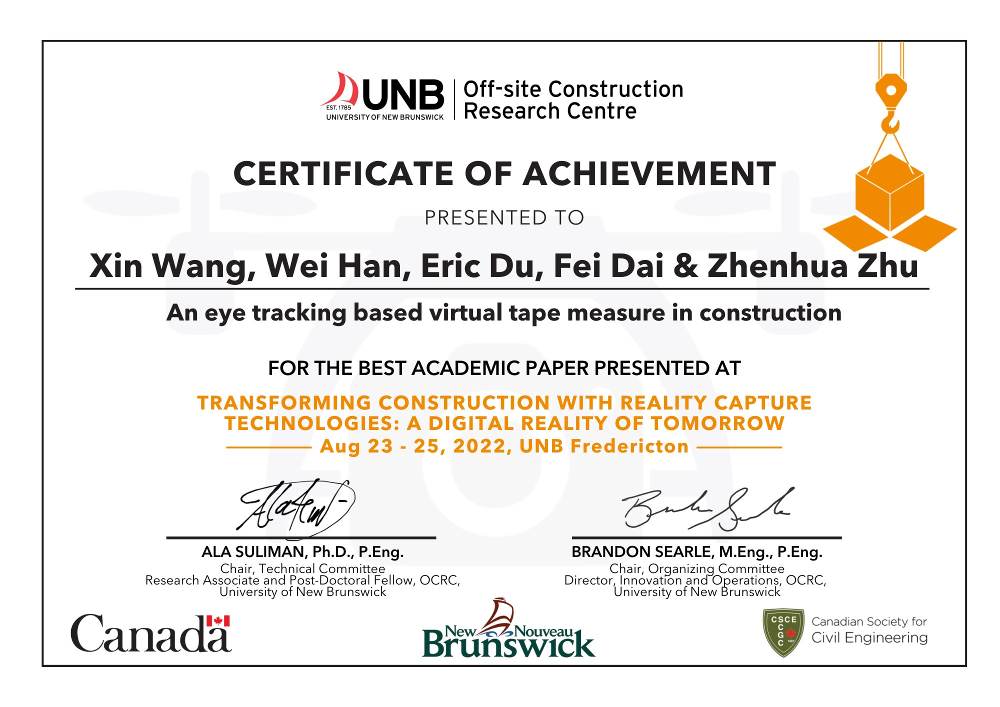
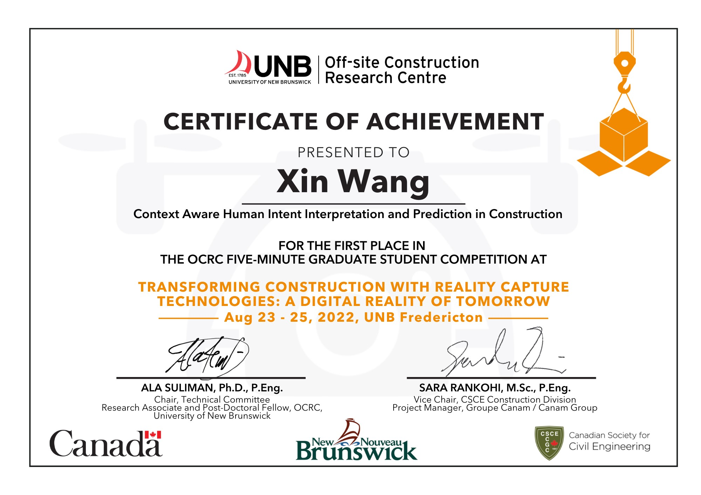



## [Best Paper Award Across All Tracks (~400 papers) in CI & CRC Joint Conference](https://engineering.wisc.edu/blog/xin-wang-redefines-human-robot-collaboration-in-construction/) 

*American Society of Civil Engineering*, March 2024

  

    
  

  

    
  

---

## Best Academic Paper Award in Transforming Construction with Reality Capture Technologies Conference

*Canadian Society for Civil Engineering*, August 2022

  

---

## First Place in Student Research Presentation in Transforming Construction with Reality Capture Technologies Conference

*Canadian Society for Civil Engineering*, August 2022

  

---

## First Place in VIMS-IAARC Joint Datathon Competition

*American Society of Civil Engineering*, June 2022

  

<!-- Education
======
* Ph.D in Version Control Theory, GitHub University, 2018 (expected)
* M.S. in Jekyll, GitHub University, 2014
* B.S. in GitHub, GitHub University, 2012

Work experience
======
* Spring 2024: Academic Pages Collaborator
  * Github University
  * Duties includes: Updates and improvements to template
  * Supervisor: The Users

* Fall 2015: Research Assistant
  * Github University
  * Duties included: Merging pull requests
  * Supervisor: Professor Hub

* Summer 2015: Research Assistant
  * Github University
  * Duties included: Tagging issues
  * Supervisor: Professor Git
  
Skills
======
* Skill 1
* Skill 2
  * Sub-skill 2.1
  * Sub-skill 2.2
  * Sub-skill 2.3
* Skill 3

Publications
======
  <ul>
    
  </ul>
  
Talks
======
  <ul>
    
  </ul>
  
Teaching
======
  <ul>
    
  </ul>
  
Service and leadership
======
* Currently signed in to 43 different slack teams -->
