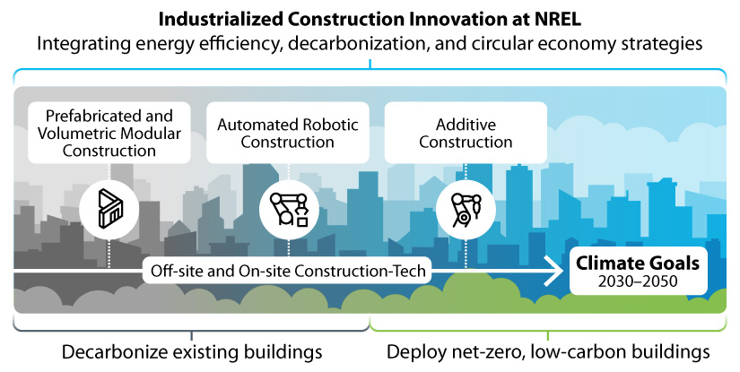
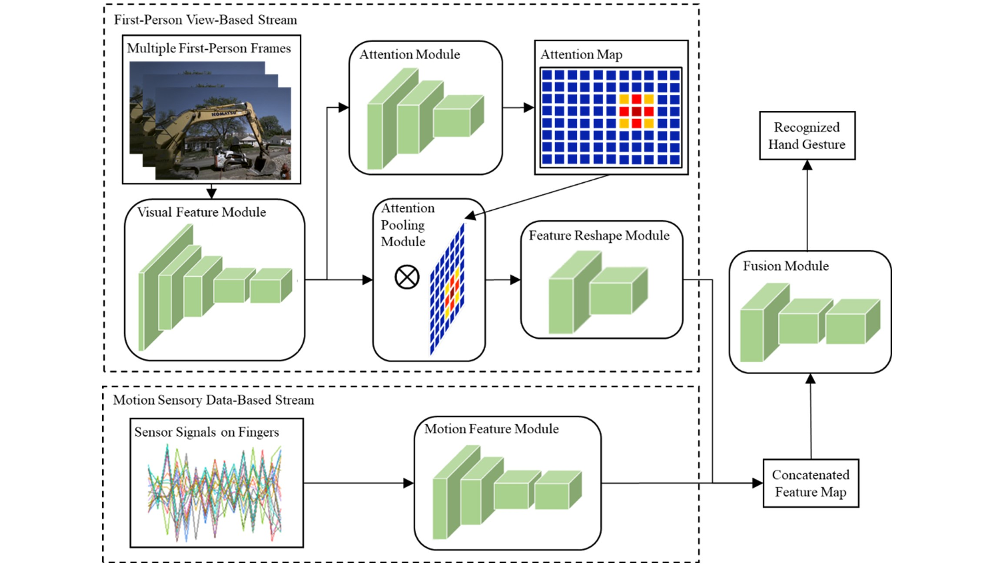



## Industrializing Construction to Decarbonize Buildings, *U.S. Department of Energy*

  

    
  

  

    

      Students were listening to the lecture related to the use of AutoCAD. 
    

  

---

## Context-Aware Worker Intent Interpretation for Human-Robot Collaboration in Construction, *Wisconsin Alumni Research Foundation*
### Vision–Based Framework for Automatic Interpretation of Construction Workers’ Hand Gestures 
[Papers 1](https://www.sciencedirect.com/science/article/abs/pii/S0926580521000765), [2](https://www.sciencedirect.com/science/article/abs/pii/S092658052100323X)

  
  <!-- Left: Video 1 -->
  

    

      <iframe style="position: absolute; top: 0; left: 0; width: 100%; height: 100%;" 
      src="https://www.youtube.com/embed/ew2U-zLq87I" frameborder="0" allowfullscreen></iframe>
    

    
Field Test Results On a Construction Site Near Milwaukee, WI

  

  <!-- Right: Video 2 -->
  

    

      <iframe style="position: absolute; top: 0; left: 0; width: 100%; height: 100%;" 
      src="https://www.youtube.com/embed/LV8_7O8yeCE" frameborder="0" allowfullscreen></iframe>
    

    
Pilot Study for Human Machine Interaction in Construction

  

### Wearable Sensors-Based Hand Gesture Recognition for Human-Robot Collaboration in Construction
[Papers 1](https://ieeexplore.ieee.org/abstract/document/9961200), [2](https://linkinghub.elsevier.com/retrieve/pii/S0952197623003639)

  
  <!-- Left: Video 1 -->
  

    

      <iframe style="position: absolute; top: 0; left: 0; width: 100%; height: 100%;" 
      src="https://www.youtube.com/embed/e2Uf2nTtvsc" frameborder="0" allowfullscreen></iframe>
    

    
Wearable Sensors-Based Hand Gesture Recognition

  

  <!-- Right: Video 2 -->
  

    

      <iframe style="position: absolute; top: 0; left: 0; width: 100%; height: 100%;" 
      src="https://www.youtube.com/embed/Xhx9rJ9TWmw" frameborder="0" allowfullscreen></iframe>
    

    
Gaze-Aware Gesture Recognition for Intelligent Construction

  

### Context-Aware Hand Gesture Interaction for Intelligent Construction
[Paper](https://onlinelibrary.wiley.com/doi/full/10.1111/mice.13202)

  
  <!-- Left: Figure -->
  

    

      
    

    
Two-Stream Context-Aware Recognition Architecture

  

  <!-- Right: Video -->
  

    

      <iframe style="position: absolute; top: 0; left: 0; width: 100%; height: 100%;" 
      src="https://www.youtube.com/embed//WZ1Y1_LToE4" frameborder="0" allowfullscreen></iframe>
    

    
Context-Aware Gesture Interaction with Attention Maps

  

---

## Transformer-Based Segmentation for Recycling Materials in Construction, *First Flace in [VIMS-IAARC Joint Datathon 2022 Competition](https://www.linkedin.com/feed/update/urn:li:activity:6918671751778373632/)*
[Paper](https://www.sciencedirect.com/science/article/pii/S0926580523002431)

  
  <!-- Left: Video 1 -->
  

    

      <iframe style="position: absolute; top: 0; left: 0; width: 100%; height: 100%;" 
      src="https://www.youtube.com/embed/9H7RmYF8cH8" frameborder="0" allowfullscreen></iframe>
    

    
Video Demonstration on Debris and Rebars

  

  <!-- Right: Video 2 -->
  

    

      <iframe style="position: absolute; top: 0; left: 0; width: 100%; height: 100%;" 
      src="https://www.youtube.com/embed/w8OFkWJsN0Y" frameborder="0" allowfullscreen></iframe>
    

    
Video Demonstration on PVC Pipes

  

<!-- Education
======
* Ph.D in Version Control Theory, GitHub University, 2018 (expected)
* M.S. in Jekyll, GitHub University, 2014
* B.S. in GitHub, GitHub University, 2012

Work experience
======
* Spring 2024: Academic Pages Collaborator
  * Github University
  * Duties includes: Updates and improvements to template
  * Supervisor: The Users

* Fall 2015: Research Assistant
  * Github University
  * Duties included: Merging pull requests
  * Supervisor: Professor Hub

* Summer 2015: Research Assistant
  * Github University
  * Duties included: Tagging issues
  * Supervisor: Professor Git
  
Skills
======
* Skill 1
* Skill 2
  * Sub-skill 2.1
  * Sub-skill 2.2
  * Sub-skill 2.3
* Skill 3

Publications
======
  <ul>
    
  </ul>
  
Talks
======
  <ul>
    
  </ul>
  
Teaching
======
  <ul>
    
  </ul>
  
Service and leadership
======
* Currently signed in to 43 different slack teams -->
